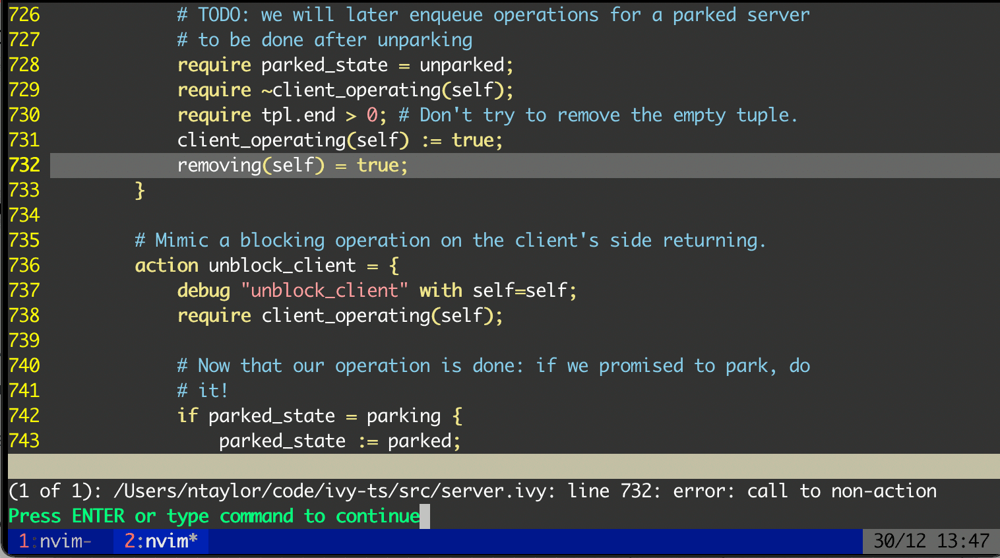

# vim-ivy
Vim syntax plugin for IVy

This is a Vim syntax plugin for the [IVy][ivy] language, styled after its
[Emacs major mode][emacs] and the [language lexer][lexer].



## Installation

### Using [Vundle][v]

1. Add `Plugin 'dijkstracula/vim-ivy'` to `~/.vimrc`
2. `vim +PluginInstall +qall`

### Using [Pathogen][p]

1. `cd ~/.vim/bundle`
2. `git clone https://github.com/dijkstracula/vim-ivy.git`

## Using NeoVim and [Vim-Plug][vp]

1. Add `Plug 'dijkstracula/vim-ivy'` to your e.g. `~/.config/nvim/plugins.vim`
2. Save and run `:PlugInstall`

TODO: actually test Pathogen install commands; they were stolen from elsewhere.

## Syntax checking (beta!)

To perform syntax checking on an open buffer, run `:make` on the Command Line.
Or, to always check on save, add `autocmd BufWritePost *.ivy make` to your
`.vimrc` file.  The QuickFix window will be populated with errors from `ivyc`.

Note: this feature is currently experimental as it requires a bit of hacking
around `ivyc`; for details, see [doit.sh][doit] and please file issues if you
come across any.  Additionally, it's currently a synchronous operation, even in
Vim 8 and NeoVim; hopefully Ivy 2 will expose an LSP that any editor can
communicate with down the road.

## Bundling

Typically, distribution via Git is prefered; however, for uploading to e.g.
[vim.org][vimorg] it's useful to bundle the contents of the repository as a
tarball as well.

```
$ git pull
$ git archive -o ./vim-ivy.tar.gz HEAD
$ scp vim-ivy.tar.gz ...
```

## Contributing

PRs welcome - this is definitely a work in progress.

## Licence

Copyright (c) 2021 Nathan Taylor; licenced under MIT: See the LICENSE file for
details.

[doit]: https://github.com/dijkstracula/vim-ivy/blob/main/compiler/doit.sh
[emacs]: https://github.com/kenmcmil/ivy/blob/master/lib/emacs/ivy-mode.el
[ivy]: https://microsoft.github.io/ivy/
[lexer]: https://github.com/kenmcmil/ivy/blob/master/ivy/ivy_lexer.py
[p]: https://github.com/tpope/vim-pathogen
[v]: https://github.com/gmarik/vundle
[vimorg]: https://www.vim.org/scripts/script.php?script_id=5991
[vp]: https://github.com/junegunn/vim-plug
